# Cyclistic Case Study
This is a case study is part of Google Data Analytics professional certification requirement. The certification is for learning the roadmap for six stage of the data analytic processes namely, ASK, PREPARE, PROCESS, ANALYZE, SHARE and ACT. The certification consist of 8 modules and the last module is this case study. This is the link to the [courses](https://www.coursera.org/professional-certificates/google-data-analytics). 
## Data and Scope
The dataset for this case study is provided by Divvy Bike Sharing Company from Chicago. Cyclistic is a fictional company with the data analytic task. The dataset contain trip data with start and end stations, start and end time stamps, bike type, and user type. Detailed scope of this project is described in 0_Scope.ipynb and 1_Ask.ipynb.

### Stage 1 - ASK
The business task is defined as: In order to support the business stakeholder for increasing rider conversion from casual riders to annual members, the data analyst needs to help discover how they use Cyclistic bikes differently.

I will break down the task into:

    - How many rides per month? How are they trending in time?
    - How different are the ride durations? By hour of day and by day of week.
    - How different are  usages by locations? 
    - Any locations that standout with large casual usages? (potential high conversion user group)

### Stage 2 - PREPARE
The dataset consists of individual csv files for each month. The zipped files are downloaded via wget and saved locally. 

### Stage 3 - PROCESS

#### Data Schema
The data columns are consistent throughout the csv files. The left column is the header and right column is the data type declared for python pandas datatype.

    ride_id                       object
    rideable_type               category
    started_at            datetime64[ns]
    ended_at              datetime64[ns]
    start_station_name          category
    start_station_id            category
    end_station_name            category
    end_station_id              category
    start_lat                    float64
    start_lng                    float64
    end_lat                      float64
    end_lng                      float64
    member_casual               category

### Cleaning
Each csv file is cleaned though a set of rules and saved to a cleaned_csv data folder.

    - drop rows with null data
    - drop rows with trip start time greater than trip stop time
    - drop rows with station ids with lat/lng association abnomaly
    - drop rows with station names with "Temp" indicating test trips
    - drop rows with durations abnomaly (one trip was almost one month)

### Merge
The cleaned csv files are merged into one big csv file for future manipulations.
Keep in mind, it is also possible to do data manipulations for individual csv and aggregate the data month to month. I have opted for using a big dataframe this time.

## Stage 4 - ANALYZE
### Bike Trip Counts by Station Locations
In order to best visualize the bike trips and their locations. I summarized the trip counts by station and by month. The data is published in Tableau.
The dashboard contains two panes so it will be easier to do comparison by filtering different month or rider types.
This is the link to it 
[Cyclistic Bike Trip Count Map](https://public.tableau.com/views/CyclisticTripCountsInterativeMap/Dashboard1?:language=en-US&:display_count=n&:origin=viz_share_link)
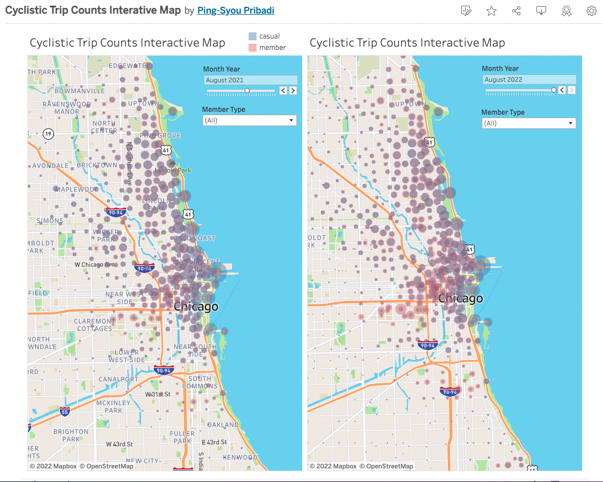
#### Observations
    - It is very clear that bike traffic is very heavy near Chicago harbor. The heaviest is at Streeter and Grand Ave. 
    - Some area has more member/casual ratio difference like Greek Town, U of Illionis at Chicago and South Commons. It can be helpful to identify demographic information by regions to further analyze the local characteristics.
    - During the cold months, the casual rides are reduced more significant than rides by members. This means commuters still braved the cold when they can.

#### Conclusions
Though it is beyond scope in analyzing locational demographics and user's ride profiles. It can be a signicant factor in deciding which user group to covert to membership.

### Ride Count by Rider type and Bike type
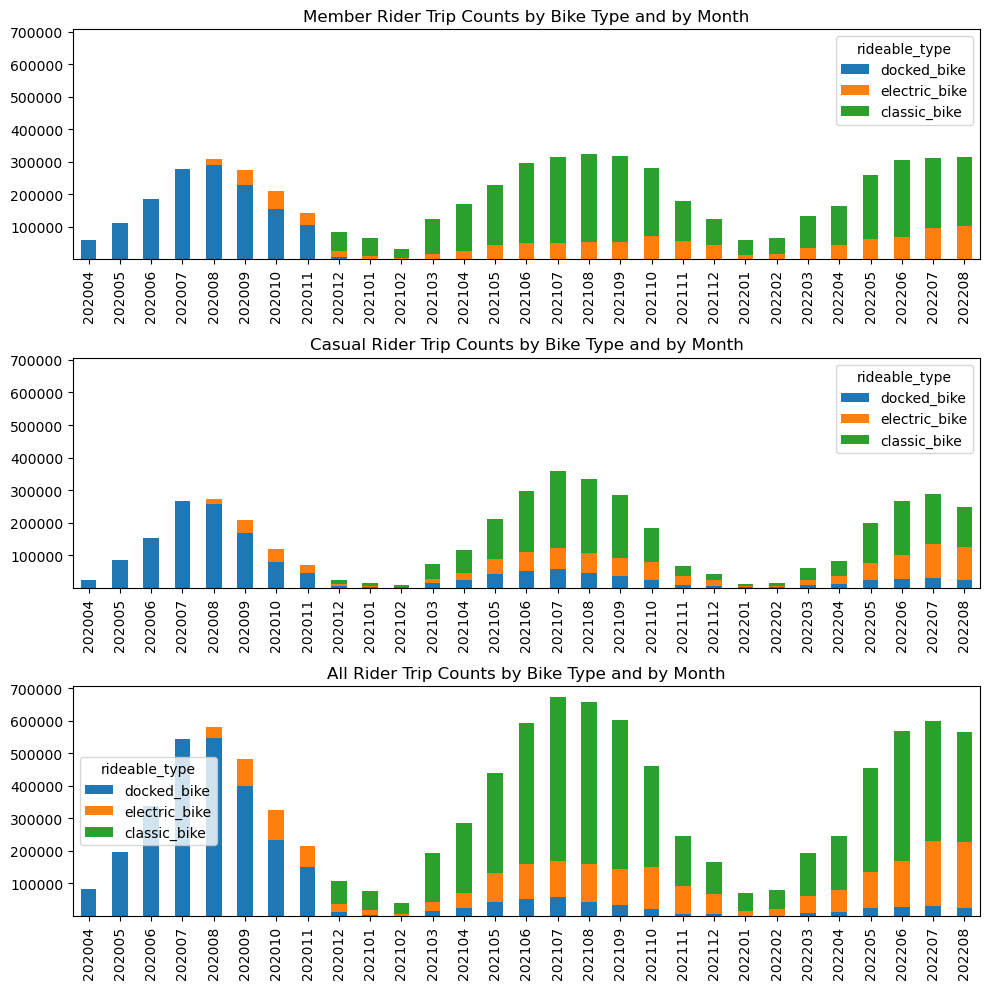
##### Observations:

    - Rideable type docked_bike was intitially the only type but is getting phased out. The casual members are slower to phase out docked_bike type. 
    - Classic_bike becomes most popular but electric_bike is gaining popularity. 
    - It is surprising that annual member which I perceive as communters choose to use classic bike over electric in comparison to casual members. Need to explore further on the motivation of choosing bike types such as bike for health, or leisure, or cost/ availability factors. (It is beyond scope for this analysis, but in reality, it is a import question.)
    - The number of rides corresponds to seasons. The rides peaked in July and August months and lowest during December through February. The ride number patterns are very similar between Casual and Annual members.
##### Conclusion:
    The ride counts between memembr and casual rider are actually quite similar. This is good news, since that also means there are many casual riders that are already familiar with using bike sharing services. We just need to find out further what will motivate them to commit to membership.
    
### Ride Duration Stats by Rider type and Bike type
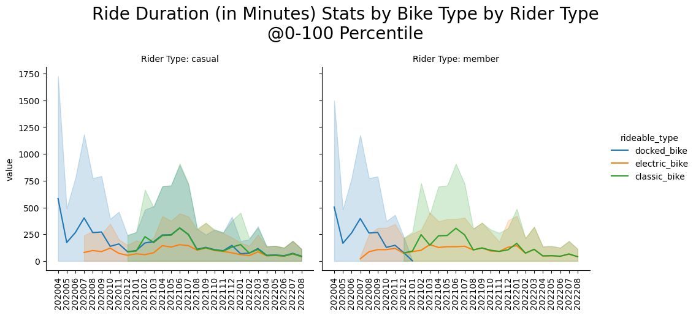
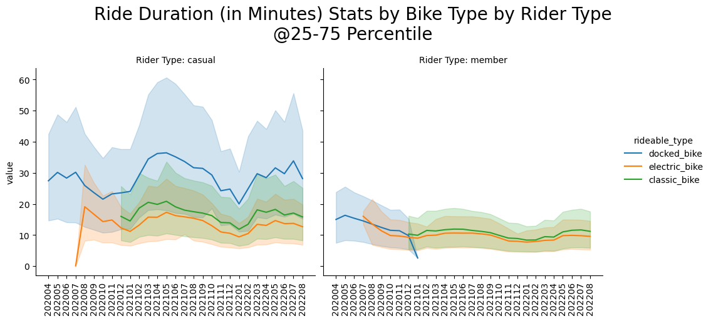
##### Observations:

  - Compare left and right figures for 0-100% (min and max), they look very similar. Meaning the maximum length of trips are not good differentiators for the rider types. But we will need to observe them in the next analysis when further dividing the trips into hour in the day and day of the week etc.
  - When looking at 25-75% of the duration stats, we see now that majority of the trips taken by members are shorter and varying less than the casual. This is likely the members use the bike for commuting so the distances are more constant. Whereas for casual riders, the ride purpose vary a lot more hence different length.
  
##### Conclusion:
    The ride duration stats shows that casual riders have more diverse trip length which differ from member riders who probably use bikes for more similar trips such as commuting and shorter trips.
    
    
### Median Ride Duration by Rider type and Day of Week/Hour of Day
Now we will try to break up the monthly stats two kinds of partitions:

     - Weekday or Weekend
     - Hour of Day
     
 We use Heatmaps with color intensity to show the dimensions:
 
     - Median Duration
     - Trip Count
 
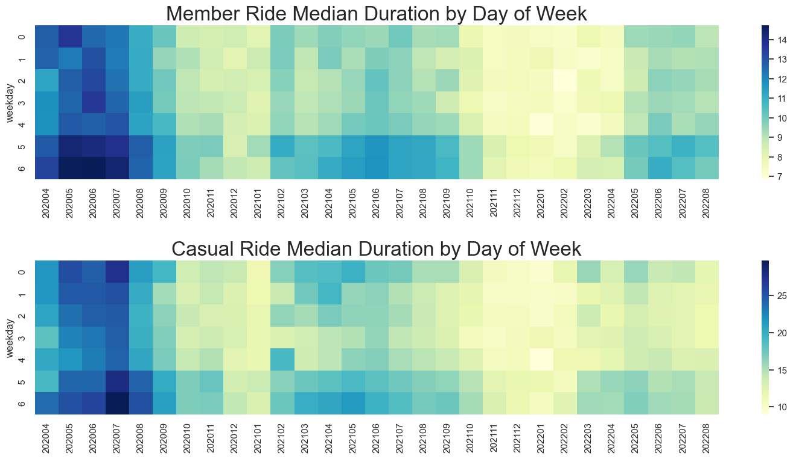
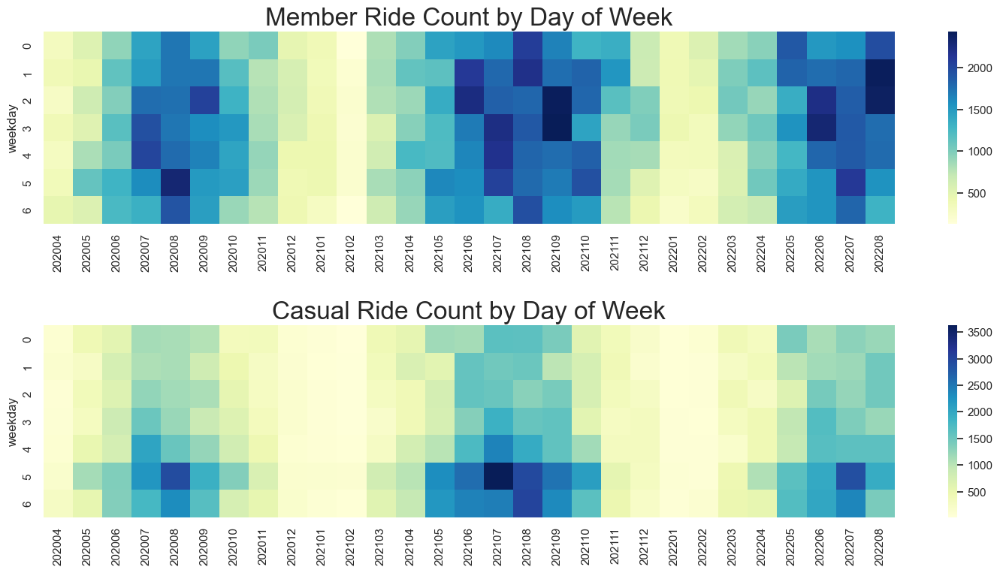
##### Observations:
    - During weekends, both casual and member take longer trips than duraing weekdays. And in general, as observed previously, casual riders take longer trips. 
    - During weekends, member riders take less trips than weekdays. This indicates that they do not take rides for pleasure.
    - We also observe the seasonality on both duration and trip count (due to weather) that colder months correspond to shorter and less trips.
    
 
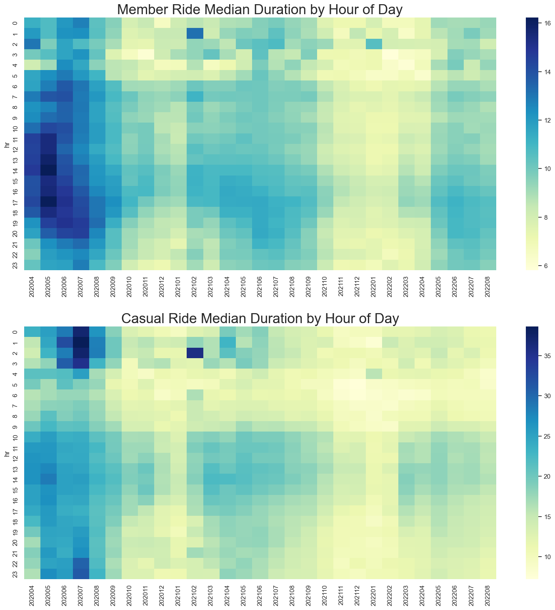
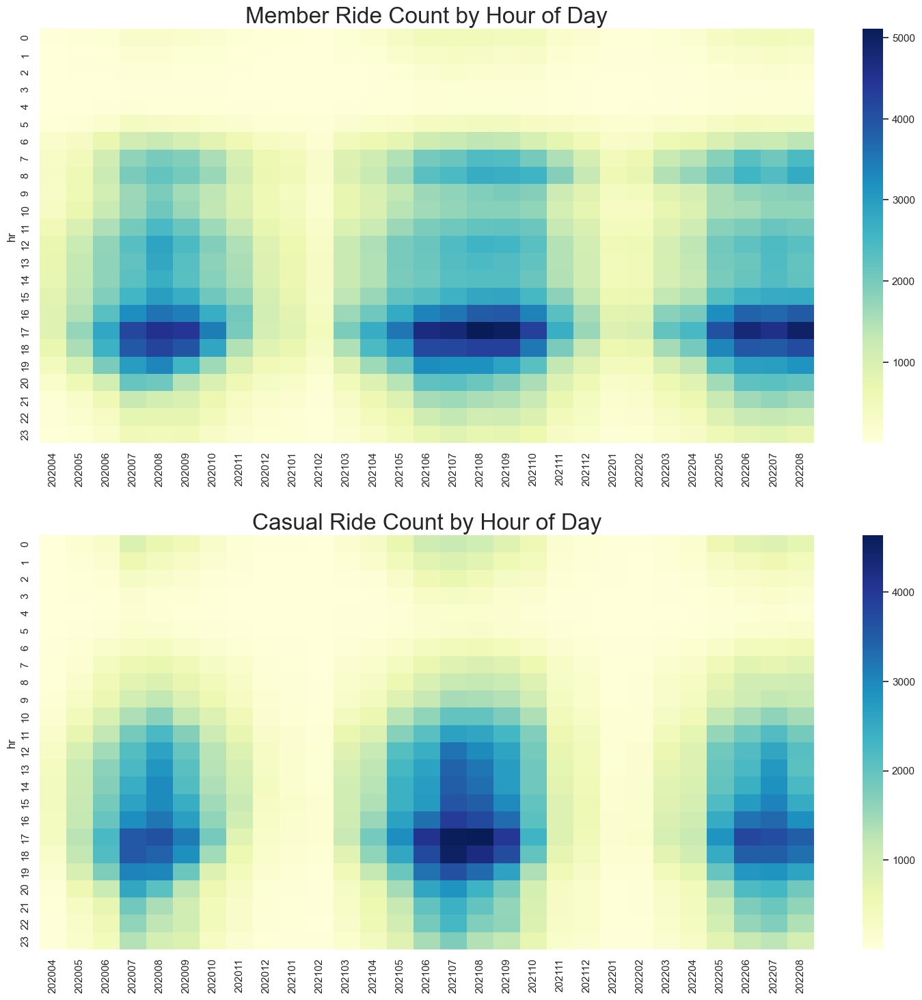

##### observations:
    - As expected, member riders counts are most heavy during 6-7am and 4-6pm due to work commute. Somewhat heavy during lunch hour.
    - As to casual riders, they also show high count of trips during 4-7pm. This should be a key behavior to further investigate. It is likely they will need to compete the use of the bikes with the commuters. The thought is if membership offers some special benefit during this peak time, they may want to convert.
    
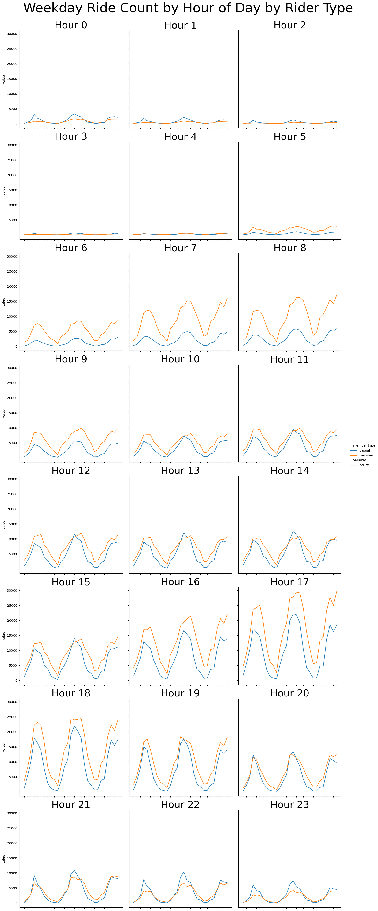
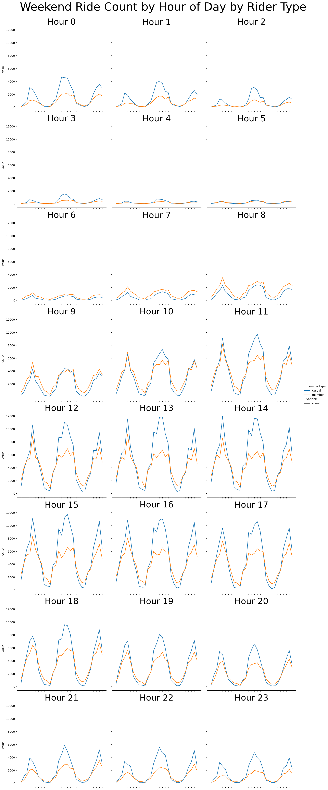
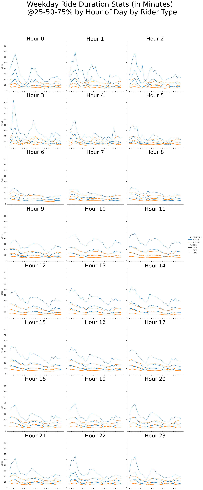
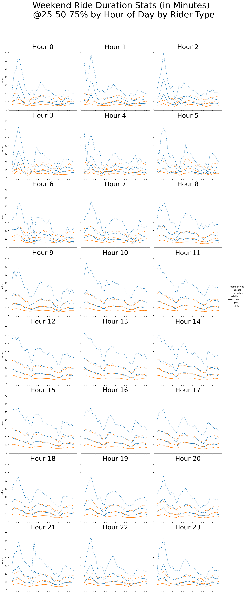
##### Conclusion:
    - Since our focus is on converting casual to member riders, we need to examine further if some casual riders actually can benefit from membership from the aspect of saving money or conveniences. We need to further examine the demographics of the users in order to profile them better. 
    - From the polularity of ridership for casual riders during the peak hours of the days, we conclude that using bike as transportation is very relevant to the riders' needs. However, I think the best approach is to collect some surveys from casual users who use the bikes frequently to find out their pain points.
    